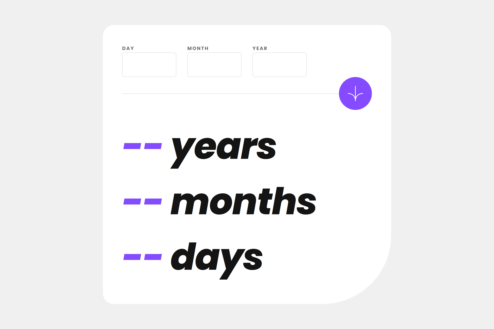

# Frontend Mentor - Age calculator app solution

This is a solution to the
[Age calculator app challenge on Frontend Mentor](https://www.frontendmentor.io/challenges/age-calculator-app-dF9DFFpj-Q).
Frontend Mentor challenges help you improve your coding skills by building realistic projects.

## Table of contents

-   [Overview](#overview)
    -   [The challenge](#the-challenge)
    -   [Screenshot](#screenshot)
    -   [Links](#links)
-   [My process](#my-process)
    -   [Built with](#built-with)
    -   [What I learned](#what-i-learned)
    -   [Continued development](#continued-development)
    -   [Useful resources](#useful-resources)
-   [Author](#author)

## Overview

### The challenge

Users should be able to:

-   View an age in years, months, and days after submitting a valid date through the form
-   Receive validation errors if:
    -   Any field is empty when the form is submitted
    -   The day number is not between 1-31
    -   The month number is not between 1-12
    -   The year is in the future
    -   The date is invalid e.g. 31/04/1991 (there are 30 days in April)
-   View the optimal layout for the interface depending on their device's screen size
-   See hover and focus states for all interactive elements on the page
-   **Bonus**: See the age numbers animate to their final number when the form is submitted

### Screenshot

### Links

-   [Solution URL](https://github.com/c0dehamster/age-calculator-app)
-   [Live Site URL](https://age-calculator-app-ochre.vercel.app/)

## My process

### Built with

-   Semantic HTML5 markup
-   CSS custom properties
-   Flexbox
-   CSS Grid
-   Mobile-first workflow
-   [Svelte] (https://svelte.dev/) - frontend framework

### What I learned

This project is my first attempt to use a JavaScript framework to build a web application. I mostly followed [this
article] (https://www.thisdot.co/blog/handling-forms-in-svelte) which provides a detailed guide for making a re-usable
form for a Svelte project.

### Continued development

I liked built-in reactivity and the ways to easily share state between components provided by Svelte and I am going to
continue using it. Hovewer, I encountered multiple bugs caused by type errors. To avoid this, I am going to start using
typescript (and be more careful I guess)

### Useful resources

-   [Svelte course from Vercel](https://vercel.com/docs/beginner-sveltekit) - the course I used to learn the framework
-   [Handling Forms in Svelte by Ignacio Falk](https://www.thisdot.co/blog/handling-forms-in-svelte)

## Author

-   Frontend Mentor - [@twDevNoob](https://www.frontendmentor.io/profile/twDevNoob)
